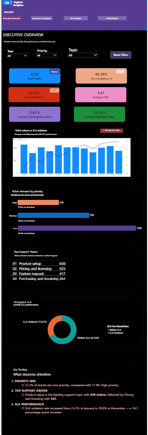

# Customer Support Analytics Dashboard

## Project Overview

This project analyzes customer support ticket data to identify trends in SLA performance, ticket demand, agent workload, and customer satisfaction.

I built an interactive Power BI dashboard that allows users to explore support performance across time, priority, topic, agent, and SLA status.

**Dataset:** Analysis was conducted on **2,330 technical support tickets** from the [Technical Support Dataset on Kaggle](https://www.kaggle.com/datasets/suvroo/technical-support-dataset). The data includes ticket priority, topic, agent, status, resolution time, first response time, and customer satisfaction scores.



## Business Questions

1. Are SLA violations associated with changes in ticket volume?
2. Which topic and priority combinations represent the greatest SLA risk?
3. Does higher agent workload appear to affect customer satisfaction?
4. Which priority levels account for the largest share of support demand?

## Key Insights

### 1. SLA violations are not clearly driven by ticket volume

SLA violation rates increased by approximately **16.1 percentage points from January to December**, while monthly ticket volume fluctuated rather than consistently increasing.

This suggests that ticket volume alone does not explain the deterioration in SLA performance.

### 2. Pricing & Licensing represents an important SLA risk

Pricing & Licensing combined relatively high SLA violation rates with substantial ticket volume:

- **Low Priority:** 36.86% violation rate across 274 tickets
- **Medium Priority:** 37.21% violation rate across 172 tickets

High-priority Training Requests had the highest observed violation rate at **54.55%**, but this was based on only **11 tickets**. This should therefore be treated as a signal to monitor rather than evidence of a persistent operational issue.

### 3. Higher agent workload does not clearly affect customer satisfaction

The workload vs. CSAT analysis showed no clear negative relationship between the number of tickets handled and customer satisfaction.

Agents with similar ticket volumes had noticeably different CSAT scores, suggesting that workload alone does not explain differences in customer satisfaction.

### 4. Low-priority tickets drive the majority of support demand

Low-priority tickets accounted for **1,192 tickets (51.2%)** of total support volume.

This concentration suggests an opportunity to investigate whether common low-priority issues could be addressed through self-service resources, improved documentation, or automation.

## Dashboard Pages

### Executive Overview

Provides a high-level view of support operations, including ticket volume, SLA performance, priority distribution, topic trends, and monthly SLA violations.

### Customer & Agent Analysis

Analyzes agent-level performance, customer satisfaction, SLA violation rates, and the relationship between agent workload and CSAT.

### SLA Analysis

Provides deeper analysis of SLA performance across topics and priorities, including a Topic × Priority heatmap for identifying potential SLA risk areas.

### Ticket Details

Provides ticket-level exploration with interactive filters for ticket ID, status, priority, topic, and SLA performance.

## Tools & Technologies

- **Power BI** — Dashboard development and data visualization
- **Power Query** — Data cleaning and transformation
- **DAX** — KPI and analytical measure development
- **Excel** — Source data preparation and validation

## Key Metrics

- Total Tickets
- SLA Compliance %
- SLA Violation %
- Average First Response Time
- Average Resolution Time
- Average CSAT
- Agent Workload
- Ticket Volume by Priority and Topic

## Recommendations

- Investigate operational factors beyond overall ticket volume that may be contributing to the increase in SLA violations.
- Prioritize deeper analysis of Pricing & Licensing tickets because they combine substantial ticket volume with elevated SLA violation rates.
- Investigate ticket type, complexity, and agent-level factors when analyzing CSAT rather than assuming workload alone drives customer satisfaction.
- Analyze the composition of low-priority tickets to identify potential opportunities for self-service, knowledge-base improvements, or automation.

## Skills Demonstrated

This project reflects an end-to-end analytics workflow, including:

- Data cleaning and transformation using Power Query
- KPI and analytical measure development using DAX
- Multi-page interactive dashboard development in Power BI
- SLA, ticket volume, agent performance, and customer satisfaction analysis
- Translation of raw data into business-focused findings and recommendations
- Validation of sample size before drawing conclusions from percentage-based metrics

## Repository Structure

```text
customer-support-analytics/
├── README.md
├── dashboard/
│   └── Customer-Support-Analytics.pbix
├── screenshots/
│   ├── executive-overview.png
│   ├── customer-agent-analysis.png
│   ├── sla-analysis.png
│   └── ticket-details.png
└── data/
    └── support-tickets.csv
